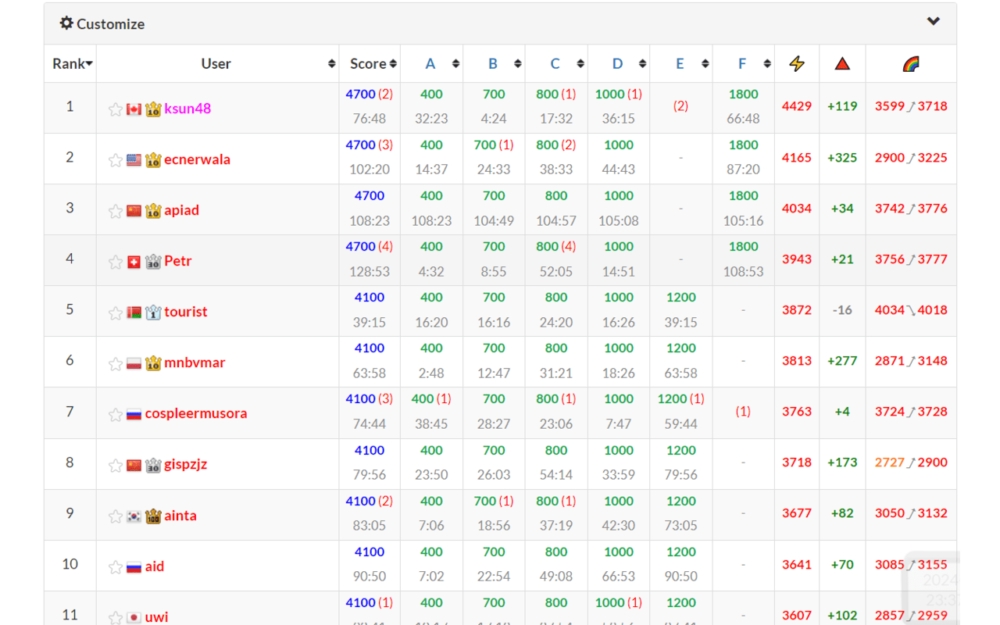
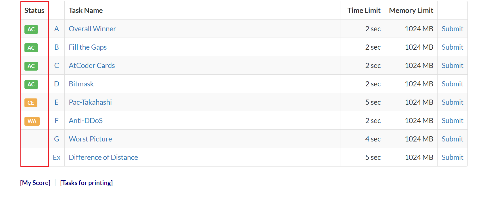
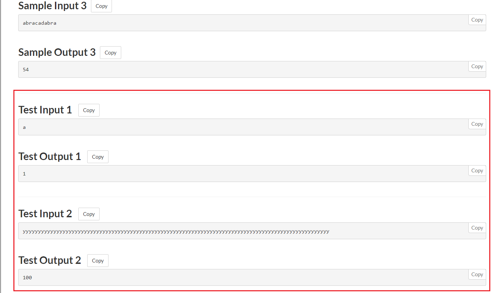
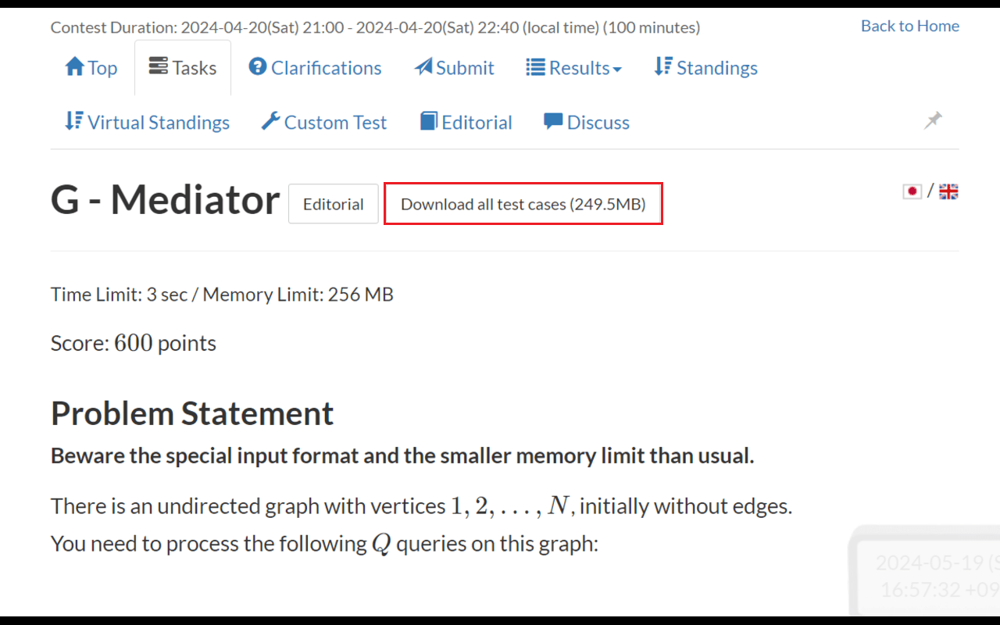
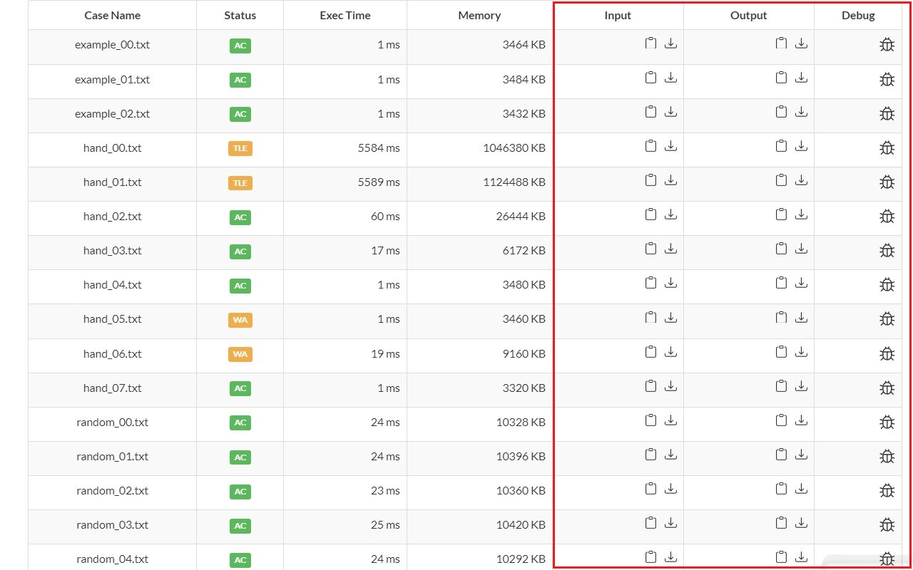
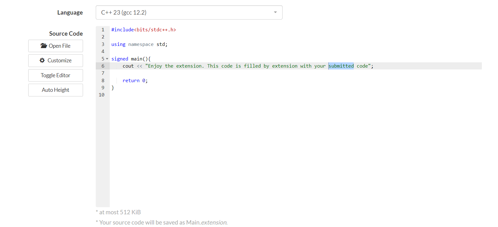
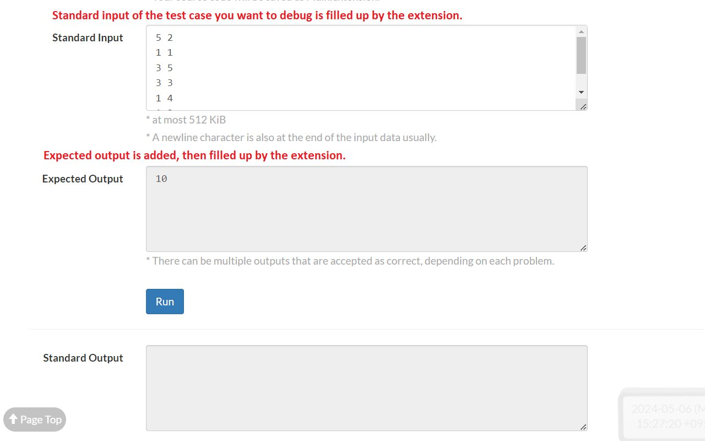

# AtCoder Companion
> A browser extension that enhances your AtCoder experience

[](https://github.com/conlacda/useful-atcoder/actions/workflows/playwright.yml) 

[](https://chromewebstore.google.com/detail/atcoder-companion/bflhekmjlbpdlibcmojpikplaldgceec) [](https://addons.mozilla.org/en-US/firefox/addon/atcoder-companion/)


## Features

### Rating prediction
Accurately predicts your rating during an ongoing contest.



### Solved problem status


### Test cases (for some older contests)
Add more test cases to the problem statement and download all test cases with one click.





You can also copy or download individual test cases and use them to debug your code.



### Debug with a custom test
> This feature is available if test cases exist for the contest.

Click one of the  buttons shown above to open a custom test page. Your submitted code and the test case input and output will be filled in automatically.




## Reference
* Some of the source code is based on [atcoder-rating-estimator](https://github.com/koba-e964/atcoder-rating-estimator).

## Accuracy limitations
When generating prediction data, the backend calculates performance using an integer rank. In reality, a rank can be rounded to the nearest 0.5 ([documentation, formula 2](https://www.dropbox.com/scl/fo/kwegqfivzi6poaxrzjv5c/AHjoZ-NKH5T-1h5xG__eUbc?dl=0&e=1&preview=rating.pdf&rlkey=mdcoluspeabxfouitvoqdb8cd)). This difference may cause prediction errors.

## Development
### .env
Before running the tests, copy `.env.example` to `.env`, then add your AtCoder account credentials.

### Run GitHub Actions locally
Start the self-hosted GitHub Actions runner. It will listen for events defined in the GitHub Actions workflow file.

```shell
cd actions-runner
./run.cmd
```
