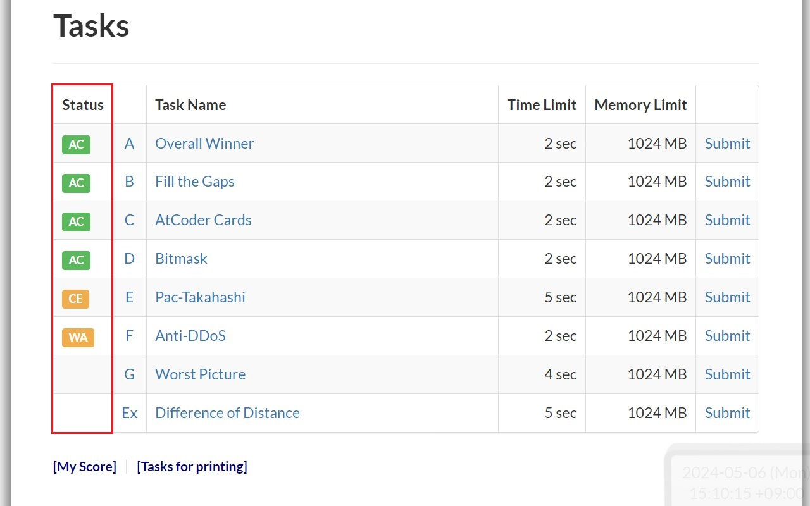

# An extension to enhance the experience for atcoder

[](https://github.com/conlacda/useful-atcoder/actions/workflows/playwright.yml)

## Some features
### Mark solved problems


### Add more test cases to problem statement


### Copy, download test cases and debug your code with those test cases


### Debug with custom test
Click one of the <svg xmlns="http://www.w3.org/2000/svg" width="1.5em" height="1.5em" viewBox="0 0 32 32" id="debug-10" style="cursor: pointer;"><path fill="currentColor" d="m29.83 20l.34-2l-5.17-.85v-4.38l5.06-1.36l-.51-1.93l-4.83 1.29A9 9 0 0 0 20 5V2h-2v2.23a8.81 8.81 0 0 0-4 0V2h-2v3a9 9 0 0 0-4.71 5.82L2.46 9.48L2 11.41l5 1.36v4.38L1.84 18l.32 2L7 19.18a8.9 8.9 0 0 0 .82 3.57l-4.53 4.54l1.42 1.42l4.19-4.2a9 9 0 0 0 14.2 0l4.19 4.2l1.42-1.42l-4.54-4.54a8.9 8.9 0 0 0 .83-3.57ZM15 25.92A7 7 0 0 1 9 19v-6h6ZM9.29 11a7 7 0 0 1 13.42 0ZM23 19a7 7 0 0 1-6 6.92V13h6Z"></path></svg> buttons you see above and a custom test page should be opened. Your submission code and input/output should be filled in.


## Features I think I should implement
* [] Predict rating during a contest
* [] Add cronjob to download test cases
* [] Add setup page

## Improvement
* Upload to Chrome store, firefox
* Write tests to make sure it works
* Follow [best practices to claim badge](https://support.google.com/chrome_webstore/answer/1050673?hl=en&visit_id=638494791511429235-3837272215&p=cws_badges&rd=1#cws_badges&zippy=%2Cunderstand-chrome-web-store-badges)

## Reference
* [Chrome extension samples](https://github.com/GoogleChrome/chrome-extensions-samples/tree/main/api-samples/alarms)

## Develop
### .env
Before running test, create .env as .env.example file then fill your atcoder account.

### Run github action
Turn self-hosted github action locally. It will listen for events defined at github action .yml file
```shell
cd actions-runner
./run.cmd
```
