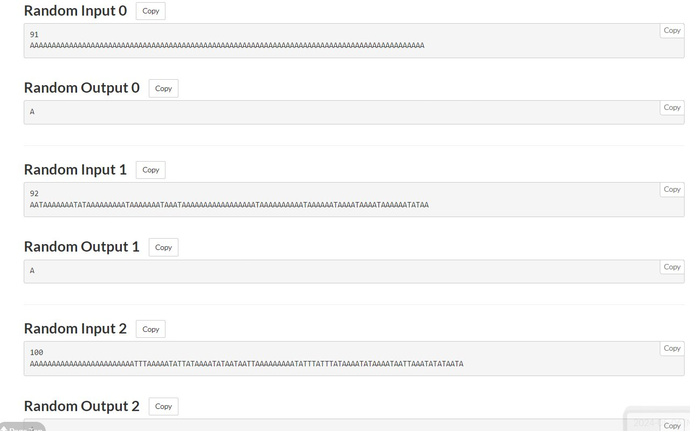

# Atcoder companion
> An extension to enhance the experience for atcoder

[](https://github.com/conlacda/useful-atcoder/actions/workflows/playwright.yml) 

[](https://chromewebstore.google.com/detail/atcoder-companion/bflhekmjlbpdlibcmojpikplaldgceec) [](https://addons.mozilla.org/en-US/firefox/addon/atcoder-companion/)


## Some features

### Estimate rating


### Mark solved problems


### Add more test cases to the problem statement & allow downloading all test cases with one click



### Copy, download test cases and debug your code with those test cases


### Debug with custom test
Click one of the  buttons you see above and a custom test page should be opened. Your submission code and input/output should be filled in.


## Features I think I should implement
* [x] Predict rating during a contest (testing)
* [ ] Show difficulty of problems (get from kenkoo)
* [ ] Add status + test cases to the printing page

## Improvement
* Add a dropdown list at the custom test page

## Ideas
* Implement some features that Codeforces is supporting (like checking diff of 2 submissions)
* Run against all test cases that have a size of less than 512KB
* Add themes (dark theme, ...)
* Allow changing fonts

## Reference
* [Chrome extension samples](https://github.com/GoogleChrome/chrome-extensions-samples/tree/main/api-samples/alarms)
* [Chrome web store documentation](https://developer.chrome.com/docs/webstore/)
* [Apply for a featured badge](https://support.google.com/chrome_webstore/contact/one_stop_support?hl=en)
* A part of my source code is copied from [atcoder-rating-estimator](https://github.com/koba-e964/atcoder-rating-estimator)

## Accuracy issue
When creating prediction data, the backend will predict performance for rank as an integer, but in reality, rank can be rounded to 0.5 ([document (formula 2)](https://www.dropbox.com/scl/fo/kwegqfivzi6poaxrzjv5c/AHjoZ-NKH5T-1h5xG__eUbc?dl=0&e=1&preview=rating.pdf&rlkey=mdcoluspeabxfouitvoqdb8cd)). Therefore, there may be prediction errors.

## Develop
### .env
Before running the tests, create .env as .env.example file then fill your atcoder account.

### Run Github action
Turn self-hosted Github action locally. It will listen for events defined at the GitHub action's .yml file
```shell
cd actions-runner
./run.cmd
```
