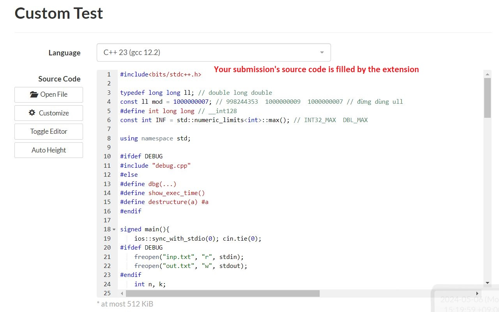
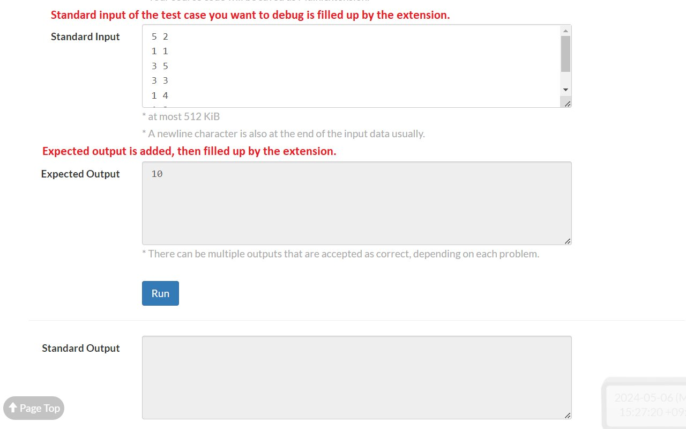

# An extension to enhance the experience for atcoder

[](https://github.com/conlacda/useful-atcoder/actions/workflows/playwright.yml)

## Some features
### Mark solved problems


### Add more test cases to problem statement


### Copy, download test cases and debug your code with those test cases


### Debug with custom test
Click one of the  buttons you see above and a custom test page should be opened. Your submission code and input/output should be filled in.




## Features I think I should implement
* [] Predict rating during a contest
* [x] Add cronjob to download test cases
* [x] Add setup page
* [] Add performance graph
* [] Show difficulty of problems (get from kenkoo)

## Improvement
* Upload to Chrome store, firefox
* Follow [best practices to claim badge](https://support.google.com/chrome_webstore/answer/1050673?hl=en&visit_id=638494791511429235-3837272215&p=cws_badges&rd=1#cws_badges&zippy=%2Cunderstand-chrome-web-store-badges)
* Add dropdown list at the custom test page
* Add firefox extension
* Should I use [javascript-obfuscator](https://github.com/javascript-obfuscator/javascript-obfuscator)??

### Testing
We need to test features when run on atcoder, also the settings popup
* [Chrome extension testing](https://developer.chrome.com/docs/extensions/how-to/test/end-to-end-testing)

## Reference
* [Chrome extension samples](https://github.com/GoogleChrome/chrome-extensions-samples/tree/main/api-samples/alarms)
* [Chrome webstore documentation](https://developer.chrome.com/docs/webstore/)
* [Apply for a featured badge](https://support.google.com/chrome_webstore/contact/one_stop_support?hl=en)

## Develop
### .env
Before running test, create .env as .env.example file then fill your atcoder account.

### Run github action
Turn self-hosted github action locally. It will listen for events defined at github action .yml file
```shell
cd actions-runner
./run.cmd
```
